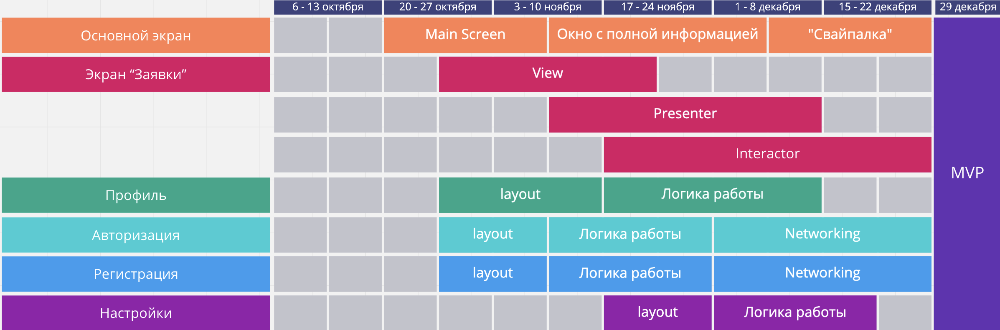

# "NewTinder" for Scientist
## Варианты названий
1. CAFS - Cool app for finding student - supervisor
## Описание проекта
### Идея
  Приложение для удобного взаимодействия студентов и научных руководителей в формате популярной социальной сети «Тиндер».
### Цель
  Улучшить процесс взаимодействия студентов и преподавателей в научной области, а также повысить эффективность поиска интересных для пользователя научных проектов.
### Основная задача
  Разработка мобильного приложения для iOS.
### Краткое описание
  Благодаря приложению студенты смогут находить научных руководителей, задавая поиск по факультету, университету или даже городу, просматривать предлагаемые темы для научных работ и отзывы других студентов, подавать заявки на участие в заинтересовавших их проектах. А преподаватели, в свою очередь, будут иметь возможность оценить имеющиеся навыки студентов, подавших заявку, а также изучить их прошлые работы.

  Новизна проекта состоит в значительном увеличении получаемой при поиске информации, то есть вместо привычной темы и ФИО руководителя/студента, пользователь уже на стадии поиска сможет получить всю необходимую для совместной научной работы информацию и принять решение о подаче или одобрении заявки. В отличие от существующей в ВШЭ формы подачи заявок на участие в проектной деятельности, использование приложения позволит избежать необходимости постоянного заполнения анкеты с данными и предотвратить долгий процесс отбора кандидатов. Кроме того, преимуществом является определенно новый для рассматриваемой области формат проекта – мобильное приложение.
## Экраны
1. Основной экран (свайпалка: свайп влево - лайк, свайп вправо - отказ) содержит такие элементы, как:
  * Фото (для возможности узнать друг друга при переходе к очному взаимодействию);
  * Тэги основных тем (для того чтобы обозначить интересующую область/увлечения);
  * Краткая основная информация;
2. Экран “Заявки” с перечнем откликнувшихся на анкету.
3. Экран “Профиль” заполняется пользователем. При заполнении указываются:
  * ФИ;
  * Фото;
  * Университет;
  * Основные темы научных работ/проектов;
  * Почта/телефон/ссылки на социальные сети/страничка на сайте университета (актуально для преподавателей).
4. Экран “Авторизация”: Авторизация в приложении.
5. Экран “Регистрация”: Регистрация в приложении.
6. Экран “Настройки”:
* Цветовая тема (темная/светлая);
* Выход из аккаунта;
## Бизнес-логика
  При первом запуске приложения необходимо будет зарегистрироваться (экран “Регистрация”), после чего заполнить всю необходимую информацию (экран “Профиль”). Если у пользователя уже есть аккаунт, то при первом запуске необходимо будет авторизоваться (экран “Авторизация”). Также приложение позволит переключать цветовую тему.

  После регистрации/авторизации пользователь может перейти к поиску студента/преподавателя с помощью основного экрана. При этом можно одобрить понравившегося пользователя, смахнув карточку влево. Если выбранный пользователь также заинтересован в сотрудничестве, его профиль появится на экране «Заявки»

## Сервер
[firebase.google.com](firebase.google.com) - сервис от Google, где хранятся файлы пользователей. Файлы представлены в виде карточек, в каждой из которых есть несколько полей, таких как пароль (в хешированном виде), личная информация и аватар.
Фотографии профилей располагаются в Cloud Storage, а в Cloud Firebase хранятся ссылки на эти аватары.
## RoadMap

## Авторы
* Мельников Иван *GnomeTV*
* Травкин Павел *Determinant179*
* Кузьмин Дмитрий *Arhangel69*
* Алена Цеплина *Alyo135*
